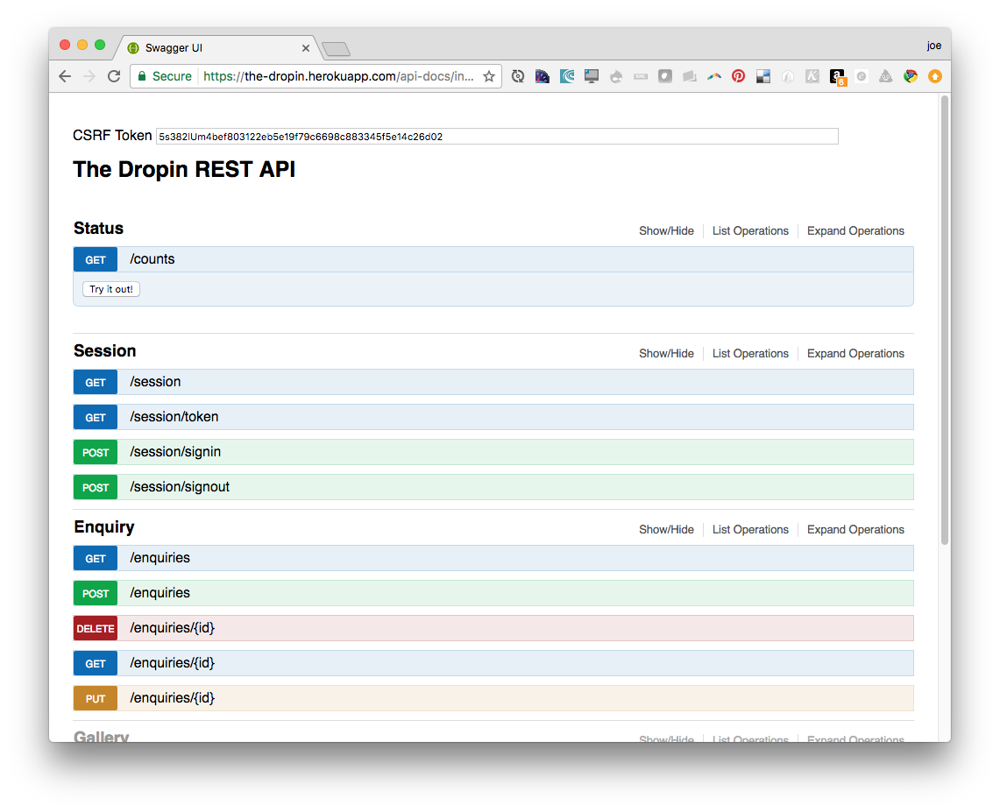

# Keystone REST

This module adds a REST resource for each *List* in your [KeystoneJS](https://github.com/keystonejs/keystone) app. An interactive [Swagger UI](https://github.com/swagger-api/swagger-ui) interface is exposed at `/api-docs/index.html`.



=====

### Usage

Install this module in your Keystone project...

```
npm i https://github.com/jbeuckm/keystone-rest
```

The routes are added to an express app with this function call: 
```javascript
require('keystone-rest').addRoutes(app, keystone)
```

In the default *yeoman-keystone* generator app, the routes are added like this:
```javascript
// Load your project's Routes
keystone.set('routes', require('./routes'));
```

You could modify this section to include the routes for this module like this:

```javascript
keystone.set('routes', function(app){
    require('./routes')(app);
    require('keystone-rest').addRoutes(app, keystone);
});
```


